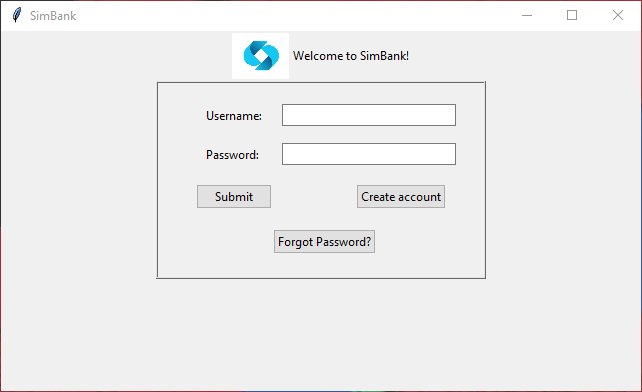
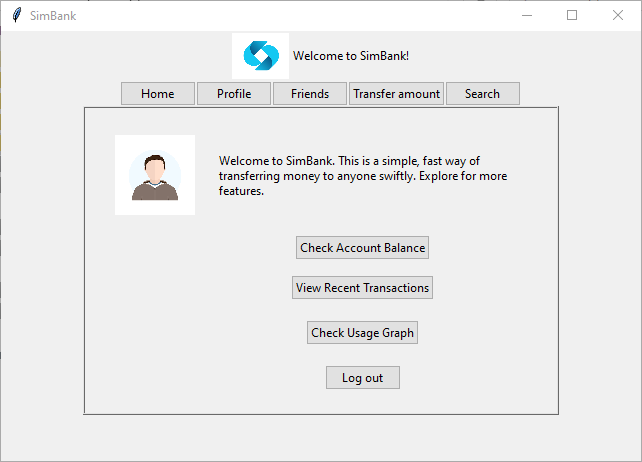
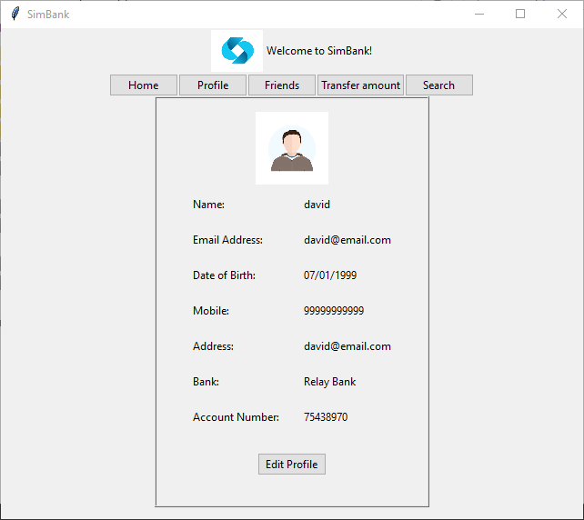
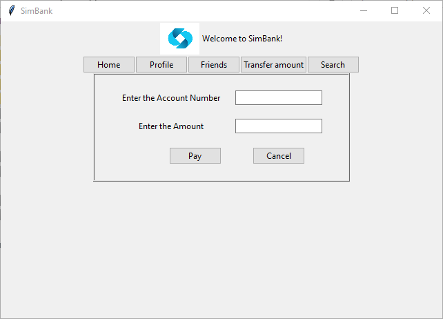

SimBank
========

SimBank is a simulated bank with mock bank accounts and corresponding details. This project is a banking app for the SimBank where you can access the details of your bank account and complete transactions.

Look how easy it is to use:

    source env-simBank/Scripts/activate
    python main.py

Features
--------

- Check balance
- Make payment
- Search friends
- Check recent transactions

Screenshots
--------

- Login

- Home

- Profile

- Transfer amount

Installation
------------

Install SimBank by cloning this repository

Contribute
----------

- Issue Tracker: github.com/solasamuel/py-2021-simbank/issues
- Source Code: github.com/solasamuel/py-2021-simbank

Support
-------

If you are having issues, please let us know at s.samuel3@yahoo.com

License
-------

The project is licensed under the BSD license.